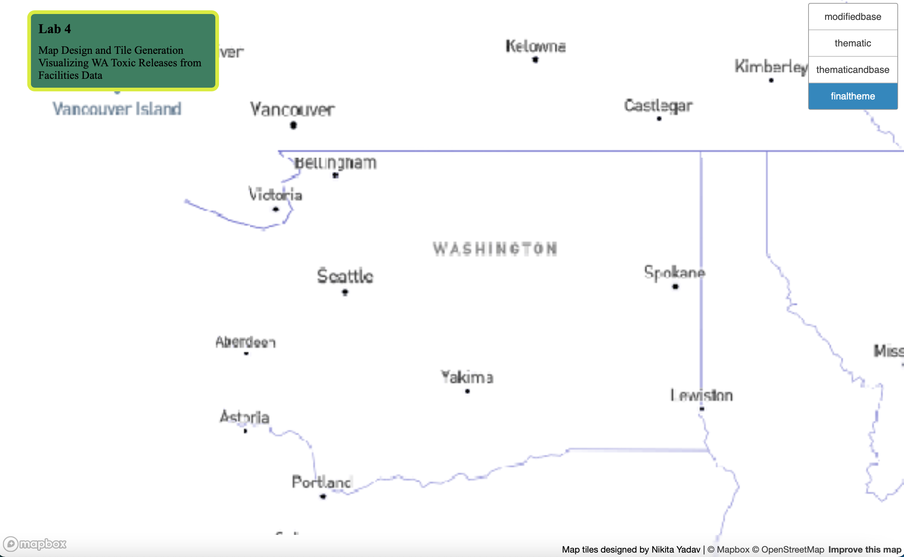

## Toxic Releases from Washington State Facilities
##### Visualized using US Census Tract Data
##### Data Source: [Washington Geospatial Open Data Portal](https://geo.wa.gov/datasets/WADOH::toxic-releases-from-facilities-rsei-model-current-version/about) 

[Access the Map Here!](https://nyadav18.github.io/geoglab4)

Layer Images:

I chose to focus my map application on Washington State only. The dataset I found broke down toxic chemical releases to air from facility emissions. The thematic layer visualizes average risk-screening environmental indicator concentrations by census tract. 

Due to computer limitations, it took a long time to generate tile sets from my QGIS map layers. For this reason, my modified base and thematic tilesets have zoom levels from 3 - 10. The final two tilesets I made have zoom levels from 3 - 6. 

My first tileset is the monochrome Mapbox Studio basemap that I adjusted the color and font for. My second tileset contains images of a choropleth map layer visualizing toxic releases by census tract using a graduated color scheme. My third tileset is the choropleth map layer overlaid on the modified basemap. My final tileset is admittedly of poor quality, I hit a wall. My best explanation is it allows the user to clearly identify city locations and observe the correlation between emission intensity and city proximity.